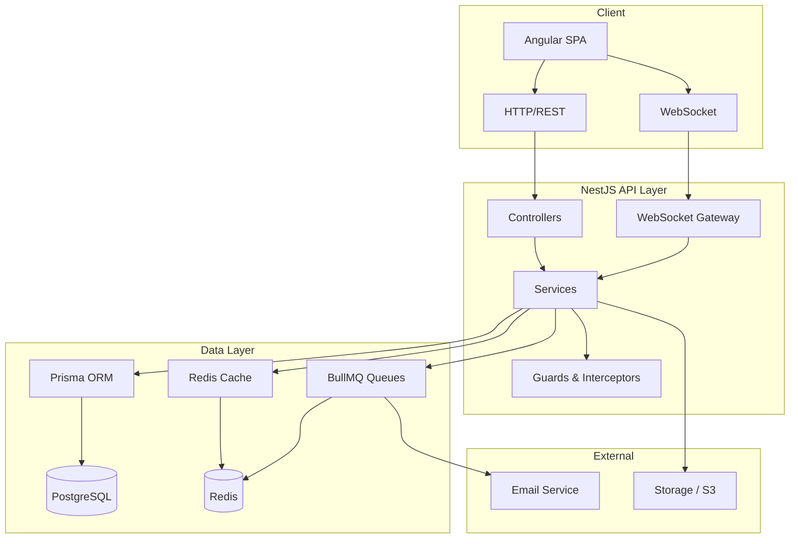
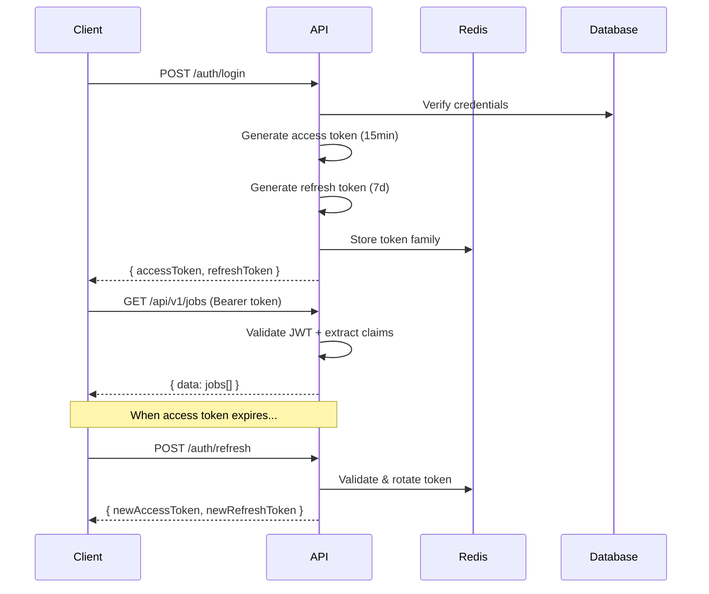
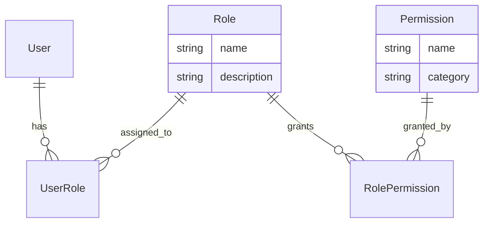

# RecruitPro — Architecture Document

## System Overview

RecruitPro is a multi-tenant SaaS recruitment platform designed for enterprise use.



## Multi-Tenancy Model

**Strategy**: Row-level isolation with `tenant_id` column.

Every tenant-scoped resource includes a `tenant_id` foreign key. Authorization middleware extracts the tenant from the JWT token and injects it into every repository query.

```
Platform
 ├── Tenant A (TechCorp)
 │    ├── Company: TechCorp Global
 │    ├── Recruiters: Sarah Chen
 │    ├── Jobs: Senior Backend Engineer, Frontend Developer
 │    └── Subscription: Professional
 │
 └── Tenant B (DesignStudio)
      ├── Company: DesignStudio Co
      ├── Recruiters: James Wilson
      ├── Jobs: Senior UI/UX Designer
      └── Subscription: Starter
```

**Isolation enforced at**:
1. Database queries (Prisma `where: { tenantId }`)
2. API guards (`@TenantGuard()`)
3. WebSocket rooms (tenant-scoped channels)
4. Background jobs (tenant context in job data)

## Authentication Flow



## RBAC Model



**Roles**: CANDIDATE, RECRUITER, HIRING_MANAGER, COMPANY_ADMIN, PLATFORM_ADMIN

**Permission format**: `entity:action` (e.g., `jobs:create`, `applications:review`)

## Module Architecture

### Backend Modules

| Module | Responsibility | Dependencies |
|--------|---------------|--------------|
| `common` | Prisma, Redis, filters, interceptors, middleware | — |
| `health` | Health/readiness endpoints | common |
| `auth` | Registration, login, JWT, password reset | common, users |
| `users` | User CRUD, profile management | common |
| `companies` | Company management | common, users |
| `candidates` | Candidate profiles, skills, education | common, users |
| `recruiters` | Recruiter profiles | common, users, companies |
| `jobs` | Job CRUD, lifecycle, search | common, companies, skills |
| `applications` | Application flow, pipeline | common, jobs, users |
| `interviews` | Scheduling, feedback | common, applications |
| `offers` | Offer lifecycle | common, applications |
| `notifications` | In-app + email notifications | common, users |
| `messaging` | Real-time conversations | common, users |
| `subscriptions` | SaaS plans, entitlements | common, companies |
| `analytics` | Dashboards, aggregations | common, all feature modules |
| `audit` | Immutable audit logging | common |
| `admin` | Platform administration | common, all modules |

### Frontend Features

| Feature | Route | Description |
|---------|-------|-------------|
| Landing | `/` | Public marketing page |
| Auth | `/auth/*` | Login, register, password reset |
| Jobs | `/jobs/*` | Job search and detail |
| Candidate | `/candidate/*` | Candidate dashboard, profile, applications |
| Recruiter | `/recruiter/*` | Recruiter dashboard, pipeline, jobs |
| Admin | `/admin/*` | Platform administration |

## Database Design Principles

1. **UUIDs** for all primary keys (security, distribution-friendly)
2. **Soft deletes** on key entities (users, companies, jobs)
3. **Audit timestamps** (`created_at`, `updated_at`) on all tables
4. **Indexes** on foreign keys and frequently queried columns
5. **Unique constraints** to prevent duplicates (e.g., one application per job per candidate)
6. **PostgreSQL native enums** for type safety and performance
7. **Full-text search** via `tsvector` column on jobs table

## Error Handling Strategy

All errors return consistent JSON:

```json
{
  "success": false,
  "error": {
    "code": "ERROR_CODE",
    "message": "Human-readable message",
    "details": [{ "field": "email", "message": "..." }]
  },
  "requestId": "correlation-id"
}
```

- **400**: Validation errors, bad requests
- **401**: Authentication required
- **403**: Insufficient permissions
- **404**: Resource not found
- **409**: Conflict (duplicate)
- **429**: Rate limited
- **500**: Internal error (details hidden in production)

## Caching Strategy

| Data | Cache Key Pattern | TTL | Invalidation |
|------|------------------|-----|-------------|
| User session | `session:{userId}` | 15min | On logout/token refresh |
| Job listing | `jobs:list:{hash}` | 5min | On job update/create |
| Skills taxonomy | `skills:all` | 1h | On skill add/update |
| Company profile | `company:{id}` | 10min | On company update |
| Rate limit | `rate:{ip}:{endpoint}` | 1min | Auto-expire |

## Security Measures

1. Helmet security headers
2. CORS with explicit origin whitelist
3. Rate limiting (10/sec, 100/min)
4. Input validation (class-validator DTOs)
5. SQL injection prevention (Prisma parameterized queries)
6. XSS protection (Angular auto-sanitization + Helmet)
7. JWT with short-lived access tokens
8. Refresh token rotation with family tracking
9. Password hashing with bcrypt (12 rounds)
10. File upload validation (type, size, MIME)
11. Tenant isolation at every data access point
12. Audit logging for all sensitive operations
